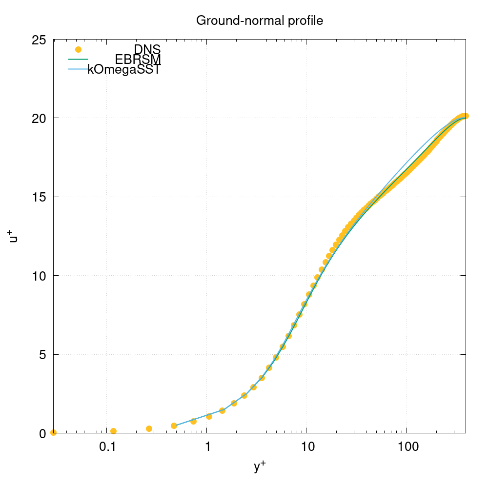

# OpenFOAMのV&V例題の実行と解読

https://develop.openfoam.com/Development/openfoam/-/tree/master/tutorials/verificationAndValidation

OpenFOAM標準例題では，V&Vに関するものが`verificationAndValidation`にまとめられている。

この中には，単機能の動作を確認するための例題と，パラメーターを変更しながらその影響を調べる例題が存在する。

基本的な構造
- 共通設定を commons ディレクトリに格納
- 個別設定を それぞれのディレクトリに格納
- 順番に個別設定の計算を実行
- 比較するグラフ等を作成する

解読の基本的な方法
1. Allrunの確認
2. 実行
3. 結果の確認


----

## 主な分類

- 単機能のテスト
- 設定・パラメータの影響調査


# 例題リスト

verificationAndValidation例題ディレクトリの構造

```shell
$ tree -L 2 -F
./
├── atmosphericModels/
│   ├── atmDownstreamDevelopment/
│   ├── atmFlatTerrain/
│   └── atmForestStability/
├── multiphase/
│   ├── StefanProblem/
│   └── interIsoFoam/
├── schemes/
│   ├── divergenceExample/
│   ├── nonOrthogonalChannel/
│   ├── skewnessCavity/
│   └── weightedFluxExample/
├── turbulenceModels/
│   └── planeChannel/
└── turbulentInflow/
    └── oneCellThickPlaneChannel/

16 directories, 0 files
```

```shell
$ tree -L 3 -F
./
├── atmosphericModels/
│   ├── atmDownstreamDevelopment/
│   │   ├── Allclean*
│   │   ├── Allrun*
│   │   ├── README.md
│   │   ├── plot*
│   │   ├── resources/
│   │   └── setups.orig/
│   ├── atmFlatTerrain/
│   │   ├── Allclean*
│   │   ├── Allrun*
│   │   ├── precursor/
│   │   └── successor/
│   └── atmForestStability/
│       ├── Allclean*
│       ├── Allrun*
│       ├── plot*
│       ├── resources/
│       └── setups.orig/
├── multiphase/
│   ├── StefanProblem/
│   │   ├── Allclean*
│   │   ├── Allrun*
│   │   ├── plot*
│   │   ├── resources/
│   │   └── setups.orig/
│   └── interIsoFoam/
│       └── porousDamBreak/
├── schemes/
│   ├── divergenceExample/
│   │   ├── 0.orig/
│   │   ├── Allclean*
│   │   ├── Allrun*
│   │   ├── README
│   │   ├── constant/
│   │   └── system/
│   ├── nonOrthogonalChannel/
│   │   ├── Allclean*
│   │   ├── Allrun*
│   │   ├── plot*
│   │   └── setups.orig/
│   ├── skewnessCavity/
│   │   ├── Allclean*
│   │   ├── Allrun*
│   │   ├── plot*
│   │   └── setups.orig/
│   └── weightedFluxExample/
│       ├── 0.orig/
│       ├── Allclean*
│       ├── Allrun*
│       ├── constant/
│       ├── plot*
│       └── system/
├── turbulenceModels/
│   └── planeChannel/
│       ├── Allclean*
│       ├── Allrun*
│       ├── plot*
│       └── setups.orig/
└── turbulentInflow/
    └── oneCellThickPlaneChannel/
        ├── Allclean*
        ├── Allrun*
        ├── plot*
        ├── resources/
        └── setups.orig/
```


## 個別例題概要

### atmosphericModels/atmDownstreamDevelopment/

> Overview
"By setting appropriate profiles for wind velocity and the turbulence
quantities at the inlet, it is often assumed that the boundary layer will
be maintained up to the buildings or obstructions in the flow." (HW:p. 355).
However, it was quantified by (HW:p. 355) that "even in the absence of
obstructions, ..., the velocity and turbulence profiles decay along the
fetch" (HW:p. 355). It was shown by (HW:p. 355) that a set of modifications
were required to maintain a neutral atmospheric boundary layer throughout
an empty and long computational domain of a RANS computation.
> 
> Aim
> 
> Verification of the atmospheric boundary-layer boundary conditions in terms
of the maintenance of inlet quantities downstream within a RANS computation:
> 
> atmBoundaryLayerInletVelocity
> atmBoundaryLayerInletK
> atmBoundaryLayerInletEpsilon
> atmBoundaryLayerInletOmega


```shell
/run/verificationAndValidation/atmosphericModels/atmDownstreamDevelopment$ ./Allrun

# Create the setup: kEpsilon

# Run the setup: kEpsilon

Restore 0/ from 0.orig/
Running blockMesh on /home/nakagawa/OpenFOAM/nakagawa-v2412/run/verificationAndValidation/atmosphericModels/atmDownstreamDevelopment/results/kEpsilon
Running renumberMesh on /home/nakagawa/OpenFOAM/nakagawa-v2412/run/verificationAndValidation/atmosphericModels/atmDownstreamDevelopment/results/kEpsilon
Running checkMesh on /home/nakagawa/OpenFOAM/nakagawa-v2412/run/verificationAndValidation/atmosphericModels/atmDownstreamDevelopment/results/kEpsilon
Running decomposePar on /home/nakagawa/OpenFOAM/nakagawa-v2412/run/verificationAndValidation/atmosphericModels/atmDownstreamDevelopment/results/kEpsilon
Running simpleFoam (8 processes) on /home/nakagawa/OpenFOAM/nakagawa-v2412/run/verificationAndValidation/atmosphericModels/atmDownstreamDevelopment/results/kEpsilon
Running reconstructPar on /home/nakagawa/OpenFOAM/nakagawa-v2412/run/verificationAndValidation/atmosphericModels/atmDownstreamDevelopment/results/kEpsilon

## Store the mesh of kEpsilon as the common mesh


# Create the setup: kOmegaSST

# Run the setup: kOmegaSST

## Copy the common mesh to the setup: kOmegaSST

Restore 0/ from 0.orig/
Running decomposePar on /home/nakagawa/OpenFOAM/nakagawa-v2412/run/verificationAndValidation/atmosphericModels/atmDownstreamDevelopment/results/kOmegaSST
Running simpleFoam (8 processes) on /home/nakagawa/OpenFOAM/nakagawa-v2412/run/verificationAndValidation/atmosphericModels/atmDownstreamDevelopment/results/kOmegaSST
Running reconstructPar on /home/nakagawa/OpenFOAM/nakagawa-v2412/run/verificationAndValidation/atmosphericModels/atmDownstreamDevelopment/results/kOmegaSST

# Plots for the setup: kEpsilon

  # Plots the ground-normal flow speed profile (upstream)
  # Plots the ground-normal flow speed profile (mid-range)
  # Plots the ground-normal flow speed profile (downstream)
  # Plots the ground-normal turbulent kinetic energy profile
  # Plots the ground-normal turbulent kinetic energy dissipation rate profile
  # Plots the ground-normal turbulent viscosity profile

# Plots for the setup: kOmegaSST

  # Plots the ground-normal flow speed profile (upstream)
  # Plots the ground-normal flow speed profile (mid-range)
  # Plots the ground-normal flow speed profile (downstream)
  # Plots the ground-normal turbulent kinetic energy profile
  # Plots the ground-normal specific dissipation rate profile
  # Plots the ground-normal turbulent viscosity profile
```

### atmosphericModels/atmFlatTerrain/

```shell
> run/verificationAndValidation/atmosphericModels/atmFlatTerrain$ ./Allrun
> 
> # Create the setup: kEpsilon
> 
> # Run the setup: kEpsilon
> 
> Restore 0/ from 0.orig/
> Running blockMesh on /home/nakagawa/OpenFOAM/nakagawa-v2412/run/verificationAndValidation/atmosphericModels/atmFlatTerrain/precursor/results/kEpsilon
> Running renumberMesh on /home/nakagawa/OpenFOAM/nakagawa-v2412/run/verificationAndValidation/atmosphericModels/atmFlatTerrain/precursor/results/kEpsilon
> Running checkMesh on /home/nakagawa/OpenFOAM/nakagawa-v2412/run/verificationAndValidation/atmosphericModels/atmFlatTerrain/precursor/results/kEpsilon
> Running decomposePar on /home/nakagawa/OpenFOAM/nakagawa-v2412/run/verificationAndValidation/atmosphericModels/atmFlatTerrain/precursor/results/kEpsilon
> Running buoyantBoussinesqSimpleFoam (2 processes) on /home/nakagawa/OpenFOAM/nakagawa-v2412/run/verificationAndValidation/atmosphericModels/atmFlatTerrain/precursor/results/kEpsilon
> Running reconstructPar on /home/nakagawa/OpenFOAM/nakagawa-v2412/run/verificationAndValidation/atmosphericModels/atmFlatTerrain/precursor/results/kEpsilon
> Running transformPoints on /home/nakagawa/OpenFOAM/nakagawa-v2412/run/verificationAndValidation/atmosphericModels/atmFlatTerrain/precursor/results/kEpsilon
> 
> ## Store the mesh of kEpsilon as the common mesh
> 
> 
> # Create the setup: kOmegaSST
> 
> # Run the setup: kOmegaSST
> 
> ## Copy the common mesh to the setup: kOmegaSST
> 
> Restore 0/ from 0.orig/
> Running decomposePar on /home/nakagawa/OpenFOAM/nakagawa-v2412/run/verificationAndValidation/atmosphericModels/atmFlatTerrain/precursor/results/kOmegaSST
> Running buoyantBoussinesqSimpleFoam (2 processes) on /home/nakagawa/OpenFOAM/nakagawa-v2412/run/verificationAndValidation/atmosphericModels/atmFlatTerrain/precursor/results/kOmegaSST
> Running reconstructPar on /home/nakagawa/OpenFOAM/nakagawa-v2412/run/verificationAndValidation/atmosphericModels/atmFlatTerrain/precursor/results/kOmegaSST
> Running transformPoints on /home/nakagawa/OpenFOAM/nakagawa-v2412/run/verificationAndValidation/atmosphericModels/atmFlatTerrain/precursor/results/kOmegaSST
> 
> # Create the setup: kL
> 
> # Run the setup: kL
> 
> ## Copy the common mesh to the setup: kL
> 
> Restore 0/ from 0.orig/
> Running decomposePar on /home/nakagawa/OpenFOAM/nakagawa-v2412/run/verificationAndValidation/atmosphericModels/atmFlatTerrain/precursor/results/kL
> Running buoyantBoussinesqSimpleFoam (2 processes) on /home/nakagawa/OpenFOAM/nakagawa-v2412/run/verificationAndValidation/atmosphericModels/atmFlatTerrain/precursor/results/kL
> Running reconstructPar on /home/nakagawa/OpenFOAM/nakagawa-v2412/run/verificationAndValidation/atmosphericModels/atmFlatTerrain/precursor/results/kL
> Running transformPoints on /home/nakagawa/OpenFOAM/nakagawa-v2412/run/verificationAndValidation/atmosphericModels/atmFlatTerrain/precursor/results/kL
> 
> # Create the setup: kEpsilon
> 
> # Run the setup: kEpsilon
> 
> Restore 0/ from 0.orig/
> Running blockMesh on /home/nakagawa/OpenFOAM/nakagawa-v2412/run/verificationAndValidation/atmosphericModels/atmFlatTerrain/successor/results/kEpsilon
> Running topoSet on /home/nakagawa/OpenFOAM/nakagawa-v2412/run/verificationAndValidation/atmosphericModels/atmFlatTerrain/successor/results/kEpsilon
> Running createPatch on /home/nakagawa/OpenFOAM/nakagawa-v2412/run/verificationAndValidation/atmosphericModels/atmFlatTerrain/successor/results/kEpsilon
> Running renumberMesh on /home/nakagawa/OpenFOAM/nakagawa-v2412/run/verificationAndValidation/atmosphericModels/atmFlatTerrain/successor/results/kEpsilon
> Running checkMesh on /home/nakagawa/OpenFOAM/nakagawa-v2412/run/verificationAndValidation/atmosphericModels/atmFlatTerrain/successor/results/kEpsilon
> Running mapFields on /home/nakagawa/OpenFOAM/nakagawa-v2412/run/verificationAndValidation/atmosphericModels/atmFlatTerrain/successor/results/kEpsilon
> Running decomposePar on /home/nakagawa/OpenFOAM/nakagawa-v2412/run/verificationAndValidation/atmosphericModels/atmFlatTerrain/successor/results/kEpsilon
> Running buoyantBoussinesqSimpleFoam (8 processes) on /home/nakagawa/OpenFOAM/nakagawa-v2412/run/verificationAndValidation/atmosphericModels/atmFlatTerrain/successor/results/kEpsilon
> Running reconstructPar on /home/nakagawa/OpenFOAM/nakagawa-v2412/run/verificationAndValidation/atmosphericModels/atmFlatTerrain/successor/results/kEpsilon
> 
> ## Store the mesh of kEpsilon as the common mesh
> 
> 
> # Create the setup: kOmegaSST
> 
> # Run the setup: kOmegaSST
> 
> ## Copy the common mesh to the setup: kOmegaSST
> 
> Restore 0/ from 0.orig/
> Running mapFields on /home/nakagawa/OpenFOAM/nakagawa-v2412/run/verificationAndValidation/atmosphericModels/atmFlatTerrain/successor/results/kOmegaSST
> Running decomposePar on /home/nakagawa/OpenFOAM/nakagawa-v2412/run/verificationAndValidation/atmosphericModels/atmFlatTerrain/successor/results/kOmegaSST
> Running buoyantBoussinesqSimpleFoam (8 processes) on /home/nakagawa/OpenFOAM/nakagawa-v2412/run/verificationAndValidation/atmosphericModels/atmFlatTerrain/successor/results/kOmegaSST
> Running reconstructPar on /home/nakagawa/OpenFOAM/nakagawa-v2412/run/verificationAndValidation/atmosphericModels/atmFlatTerrain/successor/results/kOmegaSST
> 
> # Create the setup: kL
> 
> # Run the setup: kL
> 
> ## Copy the common mesh to the setup: kL
> 
> Restore 0/ from 0.orig/
> Running mapFields on /home/nakagawa/OpenFOAM/nakagawa-v2412/run/verificationAndValidation/atmosphericModels/atmFlatTerrain/successor/results/kL
> Running decomposePar on /home/nakagawa/OpenFOAM/nakagawa-v2412/run/verificationAndValidation/atmosphericModels/atmFlatTerrain/successor/results/kL
> Running buoyantBoussinesqSimpleFoam (8 processes) on /home/nakagawa/OpenFOAM/nakagawa-v2412/run/verificationAndValidation/atmosphericModels/atmFlatTerrain/successor/results/kL
> Running reconstructPar on /home/nakagawa/OpenFOAM/nakagawa-v2412/run/verificationAndValidation/atmosphericModels/atmFlatTerrain/successor/results/kL
```

実行後のディレクトリ構造
```shell
run/verificationAndValidation/atmosphericModels/atmFlatTerrain$ tree -L 3 ./
./
├── Allclean
├── Allrun
├── precursor
│   ├── Allclean
│   ├── Allrun
│   ├── plot
│   ├── resources
│   │   └── dataset
│   ├── results
│   │   ├── kEpsilon
│   │   ├── kL
│   │   ├── kOmegaSST
│   │   └── mesh
│   ├── setups
│   │   ├── kEpsilon
│   │   ├── kL
│   │   └── kOmegaSST
│   └── setups.orig
│       ├── common
│       ├── kEpsilon
│       ├── kL
│       └── kOmegaSST
└── successor
    ├── Allclean
    ├── Allrun
    ├── results
    │   ├── kEpsilon
    │   ├── kL
    │   ├── kOmegaSST
    │   └── mesh
    ├── setups
    │   ├── kEpsilon
    │   ├── kL
    │   └── kOmegaSST
    └── setups.orig
        ├── common
        ├── kEpsilon
        ├── kL
        └── kOmegaSST
```

### atmosphericModels/atmForestStability/

```shell
run/verificationAndValidation/atmosphericModels/atmForestStability$ ./Allrun

# Create the setup: veryStable

# Run the setup: veryStable

Restore 0/ from 0.orig/
Running blockMesh on /home/nakagawa/OpenFOAM/nakagawa-v2412/run/verificationAndValidation/atmosphericModels/atmForestStability/results/veryStable
Running renumberMesh on /home/nakagawa/OpenFOAM/nakagawa-v2412/run/verificationAndValidation/atmosphericModels/atmForestStability/results/veryStable
Running checkMesh on /home/nakagawa/OpenFOAM/nakagawa-v2412/run/verificationAndValidation/atmosphericModels/atmForestStability/results/veryStable
Running decomposePar on /home/nakagawa/OpenFOAM/nakagawa-v2412/run/verificationAndValidation/atmosphericModels/atmForestStability/results/veryStable
Running setFields (2 processes) on /home/nakagawa/OpenFOAM/nakagawa-v2412/run/verificationAndValidation/atmosphericModels/atmForestStability/results/veryStable
Running buoyantBoussinesqSimpleFoam (2 processes) on /home/nakagawa/OpenFOAM/nakagawa-v2412/run/verificationAndValidation/atmosphericModels/atmForestStability/results/veryStable
Running redistributePar (2 processes) on /home/nakagawa/OpenFOAM/nakagawa-v2412/run/verificationAndValidation/atmosphericModels/atmForestStability/results/veryStable
Running postProcess on /home/nakagawa/OpenFOAM/nakagawa-v2412/run/verificationAndValidation/atmosphericModels/atmForestStability/results/veryStable

## Store the mesh of veryStable as the common mesh


# Create the setup: stable

# Run the setup: stable

## Copy the common mesh to the setup: stable

Restore 0/ from 0.orig/
Running decomposePar on /home/nakagawa/OpenFOAM/nakagawa-v2412/run/verificationAndValidation/atmosphericModels/atmForestStability/results/stable
Running setFields (2 processes) on /home/nakagawa/OpenFOAM/nakagawa-v2412/run/verificationAndValidation/atmosphericModels/atmForestStability/results/stable
Running buoyantBoussinesqSimpleFoam (2 processes) on /home/nakagawa/OpenFOAM/nakagawa-v2412/run/verificationAndValidation/atmosphericModels/atmForestStability/results/stable
Running redistributePar (2 processes) on /home/nakagawa/OpenFOAM/nakagawa-v2412/run/verificationAndValidation/atmosphericModels/atmForestStability/results/stable
Running postProcess on /home/nakagawa/OpenFOAM/nakagawa-v2412/run/verificationAndValidation/atmosphericModels/atmForestStability/results/stable

# Create the setup: slightlyStable

# Run the setup: slightlyStable

## Copy the common mesh to the setup: slightlyStable

Restore 0/ from 0.orig/
Running decomposePar on /home/nakagawa/OpenFOAM/nakagawa-v2412/run/verificationAndValidation/atmosphericModels/atmForestStability/results/slightlyStable
Running setFields (2 processes) on /home/nakagawa/OpenFOAM/nakagawa-v2412/run/verificationAndValidation/atmosphericModels/atmForestStability/results/slightlyStable
Running buoyantBoussinesqSimpleFoam (2 processes) on /home/nakagawa/OpenFOAM/nakagawa-v2412/run/verificationAndValidation/atmosphericModels/atmForestStability/results/slightlyStable
Running redistributePar (2 processes) on /home/nakagawa/OpenFOAM/nakagawa-v2412/run/verificationAndValidation/atmosphericModels/atmForestStability/results/slightlyStable
Running postProcess on /home/nakagawa/OpenFOAM/nakagawa-v2412/run/verificationAndValidation/atmosphericModels/atmForestStability/results/slightlyStable

# Create the setup: neutral

# Run the setup: neutral

## Copy the common mesh to the setup: neutral

Restore 0/ from 0.orig/
Running decomposePar on /home/nakagawa/OpenFOAM/nakagawa-v2412/run/verificationAndValidation/atmosphericModels/atmForestStability/results/neutral
Running setFields (2 processes) on /home/nakagawa/OpenFOAM/nakagawa-v2412/run/verificationAndValidation/atmosphericModels/atmForestStability/results/neutral
Running buoyantBoussinesqSimpleFoam (2 processes) on /home/nakagawa/OpenFOAM/nakagawa-v2412/run/verificationAndValidation/atmosphericModels/atmForestStability/results/neutral
Running redistributePar (2 processes) on /home/nakagawa/OpenFOAM/nakagawa-v2412/run/verificationAndValidation/atmosphericModels/atmForestStability/results/neutral
Running postProcess on /home/nakagawa/OpenFOAM/nakagawa-v2412/run/verificationAndValidation/atmosphericModels/atmForestStability/results/neutral

# Create the setup: slightlyUnstable

# Run the setup: slightlyUnstable

## Copy the common mesh to the setup: slightlyUnstable

Restore 0/ from 0.orig/
Running decomposePar on /home/nakagawa/OpenFOAM/nakagawa-v2412/run/verificationAndValidation/atmosphericModels/atmForestStability/results/slightlyUnstable
Running setFields (2 processes) on /home/nakagawa/OpenFOAM/nakagawa-v2412/run/verificationAndValidation/atmosphericModels/atmForestStability/results/slightlyUnstable
Running buoyantBoussinesqSimpleFoam (2 processes) on /home/nakagawa/OpenFOAM/nakagawa-v2412/run/verificationAndValidation/atmosphericModels/atmForestStability/results/slightlyUnstable
Running redistributePar (2 processes) on /home/nakagawa/OpenFOAM/nakagawa-v2412/run/verificationAndValidation/atmosphericModels/atmForestStability/results/slightlyUnstable
Running postProcess on /home/nakagawa/OpenFOAM/nakagawa-v2412/run/verificationAndValidation/atmosphericModels/atmForestStability/results/slightlyUnstable

# Create the setup: unstable

# Run the setup: unstable

## Copy the common mesh to the setup: unstable

Restore 0/ from 0.orig/
Running decomposePar on /home/nakagawa/OpenFOAM/nakagawa-v2412/run/verificationAndValidation/atmosphericModels/atmForestStability/results/unstable
Running setFields (2 processes) on /home/nakagawa/OpenFOAM/nakagawa-v2412/run/verificationAndValidation/atmosphericModels/atmForestStability/results/unstable
Running buoyantBoussinesqSimpleFoam (2 processes) on /home/nakagawa/OpenFOAM/nakagawa-v2412/run/verificationAndValidation/atmosphericModels/atmForestStability/results/unstable
Running redistributePar (2 processes) on /home/nakagawa/OpenFOAM/nakagawa-v2412/run/verificationAndValidation/atmosphericModels/atmForestStability/results/unstable
Running postProcess on /home/nakagawa/OpenFOAM/nakagawa-v2412/run/verificationAndValidation/atmosphericModels/atmForestStability/results/unstable
  # Plots for the ground-normal normalised streamwise flow speed profile
Not expanding variables or dictionary directives
Not expanding variables or dictionary directives
Not expanding variables or dictionary directives
Not expanding variables or dictionary directives
Not expanding variables or dictionary directives
Not expanding variables or dictionary directives
  # Plots for the ground-normal normalised turbulent kinetic energy profile
Not expanding variables or dictionary directives
Not expanding variables or dictionary directives
Not expanding variables or dictionary directives
Not expanding variables or dictionary directives
Not expanding variables or dictionary directives
Not expanding variables or dictionary directives
  # Prints the Obukhov length at a given reference height
Not expanding variables or dictionary directives
Not expanding variables or dictionary directives
Not expanding variables or dictionary directives
Not expanding variables or dictionary directives
Not expanding variables or dictionary directives
Not expanding variables or dictionary directives
  # Plots for the ground-normal normalised veer profile
Not expanding variables or dictionary directives
Not expanding variables or dictionary directives
Not expanding variables or dictionary directives
Not expanding variables or dictionary directives
Not expanding variables or dictionary directives
Not expanding variables or dictionary directives
```

実行後のディレクトリ構造

```shell
run/verificationAndValidation/atmosphericModels/atmForestStability$ tree -L 2 ./
./
├── Allclean
├── Allrun
├── plot
├── plots
│   ├── ObukhovLength.dat
│   ├── alpha_vs_zNorm.png
│   ├── dats
│   ├── kNorm_vs_zNorm.png
│   └── uNorm_vs_zNorm.png
├── resources
│   └── dataset
├── results
│   ├── mesh
│   ├── neutral
│   ├── slightlyStable
│   ├── slightlyUnstable
│   ├── stable
│   ├── unstable
│   └── veryStable
├── setups
│   ├── neutral
│   ├── slightlyStable
│   ├── slightlyUnstable
│   ├── stable
│   ├── unstable
│   └── veryStable
└── setups.orig
    ├── common
    ├── neutral
    ├── slightlyStable
    ├── slightlyUnstable
    ├── stable
    ├── unstable
    └── veryStable

27 directories, 7 files
```

### multiphase/StefanProblem/

Allrunの確認：2つのソルバを実行する。共通の設定はcommonsディレクトリからコピーされる。結果を比較するグラフを作成する。

- icoReactingMultiphaseInterFoam
- interCondensatingEvaporatingFoam

計算実行時の出力

```shell
run/verificationAndValidation/multiphase/StefanProblem$ ./Allrun

# Create the setup: icoReactingMultiphaseInterFoam

# Run the setup: icoReactingMultiphaseInterFoam

Restore 0/ from 0.orig/
Running blockMesh on /home/nakagawa/OpenFOAM/nakagawa-v2412/run/verificationAndValidation/multiphase/StefanProblem/results/icoReactingMultiphaseInterFoam
Running renumberMesh on /home/nakagawa/OpenFOAM/nakagawa-v2412/run/verificationAndValidation/multiphase/StefanProblem/results/icoReactingMultiphaseInterFoam
Running checkMesh on /home/nakagawa/OpenFOAM/nakagawa-v2412/run/verificationAndValidation/multiphase/StefanProblem/results/icoReactingMultiphaseInterFoam
Running setAlphaField on /home/nakagawa/OpenFOAM/nakagawa-v2412/run/verificationAndValidation/multiphase/StefanProblem/results/icoReactingMultiphaseInterFoam
Running setAlphaField on /home/nakagawa/OpenFOAM/nakagawa-v2412/run/verificationAndValidation/multiphase/StefanProblem/results/icoReactingMultiphaseInterFoam
Running decomposePar on /home/nakagawa/OpenFOAM/nakagawa-v2412/run/verificationAndValidation/multiphase/StefanProblem/results/icoReactingMultiphaseInterFoam
Running icoReactingMultiphaseInterFoam (2 processes) on /home/nakagawa/OpenFOAM/nakagawa-v2412/run/verificationAndValidation/multiphase/StefanProblem/results/icoReactingMultiphaseInterFoam
Running reconstructPar on /home/nakagawa/OpenFOAM/nakagawa-v2412/run/verificationAndValidation/multiphase/StefanProblem/results/icoReactingMultiphaseInterFoam

## Store the mesh of icoReactingMultiphaseInterFoam as the common mesh


# Create the setup: interCondensatingEvaporatingFoam

# Run the setup: interCondensatingEvaporatingFoam

## Copy the common mesh to the setup: interCondensatingEvaporatingFoam

Restore 0/ from 0.orig/
Running setAlphaField on /home/nakagawa/OpenFOAM/nakagawa-v2412/run/verificationAndValidation/multiphase/StefanProblem/results/interCondensatingEvaporatingFoam
Running decomposePar on /home/nakagawa/OpenFOAM/nakagawa-v2412/run/verificationAndValidation/multiphase/StefanProblem/results/interCondensatingEvaporatingFoam
Running interCondensatingEvaporatingFoam (2 processes) on /home/nakagawa/OpenFOAM/nakagawa-v2412/run/verificationAndValidation/multiphase/StefanProblem/results/interCondensatingEvaporatingFoam
Running reconstructPar on /home/nakagawa/OpenFOAM/nakagawa-v2412/run/verificationAndValidation/multiphase/StefanProblem/results/interCondensatingEvaporatingFoam

# Plots for the setup: icoReactingMultiphaseInterFoam


# Plots for the setup: interCondensatingEvaporatingFoam
```

実行後ディレクトリ構造

```shell
run/verificationAndValidation/multiphase/StefanProblem$ tree -L 2
.
├── Allclean
├── Allrun
├── plot
├── plots
│   ├── icoReactingMultiphaseInterFoam
│   └── interCondensatingEvaporatingFoam
├── resources
│   └── dataset
├── results
│   ├── icoReactingMultiphaseInterFoam
│   ├── interCondensatingEvaporatingFoam
│   └── mesh
├── setups
│   ├── icoReactingMultiphaseInterFoam
│   └── interCondensatingEvaporatingFoam
└── setups.orig
    ├── common
    ├── icoReactingMultiphaseInterFoam
    └── interCondensatingEvaporatingFoam

16 directories, 3 files
```

### multiphase/interIsoFoam/porousDamBreak/

単機能のテスト．文献との比較．

`plot`スクリプトは存在するが，Allrunからは実行されない。計算終了後に手動で実行することで，実験との比較グラフが作成される。このスクリプトでは，`gnuplot`の`multiplot`機能を使って，同じ形式で時刻が異なるグラフを並べた画像を作成する。

### schemes/divergenceExample/

移流項のスキームを様々に変更し，scalarTransportFoamソルバを実行する。直行格子を45°に横切る流れの中で，数値粘性の影響を調査する。

```
│   │   ├── log.scalarTransportFoam.LUST_gradU
│   │   ├── log.scalarTransportFoam.MUSCL
│   │   ├── log.scalarTransportFoam.Minmod
│   │   ├── log.scalarTransportFoam.QUICK
│   │   ├── log.scalarTransportFoam.SFCD
│   │   ├── log.scalarTransportFoam.SuperBee
│   │   ├── log.scalarTransportFoam.UMIST
│   │   ├── log.scalarTransportFoam.limitedLinear_02
│   │   ├── log.scalarTransportFoam.limitedLinear_10
│   │   ├── log.scalarTransportFoam.linear
│   │   ├── log.scalarTransportFoam.linearUpwind_gradU
│   │   ├── log.scalarTransportFoam.midPoint
│   │   ├── log.scalarTransportFoam.upwind
│   │   ├── log.scalarTransportFoam.vanLeer
```

### schemes/nonOrthogonalChannel/

 blockMeshの中で，alphaを10°ごとに変更している。メッシュはかなり歪んだ状態になっている。simpleFoamを実行する。

plotスクリプトで多種のグラフを作成する。gnuplotを使ったグラフ化の勉強になる。

変更するパラメータ

```
0
10
20
30
40
50
60
70
80
85
```


### schemes/skewnessCavity/

ソルバは実行しない。gradスキームによる理論値との偏差を調査する。

plotスクリプトでは，関係性の強いグループに分けて，比較グラフを作成する。

setups.origディレクトリの構成は次のようなものとなる。（実行後に作成されるものを含む。）

```
Gauss-linear
Gauss-pointLinear
cellLimited-Gauss-linear-1
cellLimited-Gauss-pointLinear-1
cellLimited-iterativeGauss-linear-5-1
cellLimited-leastSquares-1
cellMDLimited-Gauss-linear-1
cellMDLimited-Gauss-pointLinear-1
cellMDLimited-iterativeGauss-linear-5-1
cellMDLimited-leastSquares-1
faceLimited-Gauss-linear-1
faceLimited-Gauss-pointLinear-1
faceLimited-iterativeGauss-linear-5-1
faceLimited-leastSquares-1
faceMDLimited-Gauss-linear-1
faceMDLimited-Gauss-pointLinear-1
faceMDLimited-iterativeGauss-linear-5-1
faceMDLimited-leastSquares-1
iterativeGauss-linear-1
iterativeGauss-linear-2
iterativeGauss-linear-3
iterativeGauss-linear-4
iterativeGauss-linear-5
iterativeGauss-linear-10
iterativeGauss-linear-20
leastSquares
dynamicCode 
mesh
```

### schemes/weightedFluxExample/

設定を変えて laplacianFoam を実行する。

```
log.laplacianFoam.1
log.laplacianFoam.2
log.laplacianFoam.3
```

### turbulenceModels/planeChannel/

```
EBRSM
EBRSM.setTurbulenceFields
dynamicCode
kOmegaSST
mesh
```

oneCellThickPlaneChannelと同じDNSデータと比較している。

実行後ディレクトリ構造

```shell
run/verificationAndValidation/turbulenceModels/planeChannel$ tree -L 2 ./
./
├── Allclean
├── Allrun
├── plot
├── plots
│   ├── EBRSM
│   ├── all_setups_yPlus_vs_Ruu.png
│   ├── all_setups_yPlus_vs_Ruv.png
│   ├── all_setups_yPlus_vs_Rvv.png
│   ├── all_setups_yPlus_vs_Rww.png
│   ├── all_setups_yPlus_vs_epsilonPlus.png
│   ├── all_setups_yPlus_vs_kPlus0.png
│   ├── all_setups_yPlus_vs_kPlus1.png
│   ├── all_setups_yPlus_vs_productionRatePlus.png
│   ├── all_setups_yPlus_vs_uPlus.png
│   └── kOmegaSST
├── results
│   ├── EBRSM
│   ├── EBRSM.setTurbulenceFields
│   ├── dynamicCode
│   ├── kOmegaSST
│   └── mesh
├── setups
│   ├── EBRSM
│   ├── EBRSM.setTurbulenceFields
│   └── kOmegaSST
└── setups.orig
    ├── EBRSM
    ├── EBRSM.setTurbulenceFields
    ├── common
    └── kOmegaSST

18 directories, 12 files
```




### turbulentInflow/oneCellThickPlaneChannel/

```
DFM
DFSEM
FSM
mesh
```

`verificationAndValidation/turbulentInflow/oneCellThickPlaneChannel/resources`の中にDNSの実験データが存在する。

> ```
> # The data in this file was extracted from a direct numerical
> # simulation of fully developed plane turbulent channel
> # flow. Particulars are listed below. Note that some of the statistical
> # quantities provided in this data set should be zero due to
> # (statistical) symmetries in the flow. These quantities are reported
> # here none-the-less as an indicator of the quality of the statistics.
> # more statistics from this data set are available at
> # http://www.tam.uiuc.edu/Faculty/Moser/channel
> #
> # Authors: Moser, Kim & Mansour
> # Reference: DNS of Turbulent Channel Flow up to Re_tau=590, 1999,
> #            Physics of Fluids, vol 11, 943-945.
> # Numerical Method: Kim, Moin & Moser, 1987, J. Fluid Mech. vol 177, 133-166
> # Re_tau = 392.24
> # Normalization: U_tau, h
> # Description: Mean velocities and their derivatives and mean pressure
> # Filename: chan395/profiles/chan395.means
> # Date File Created: Mar 01, 2000
> ```