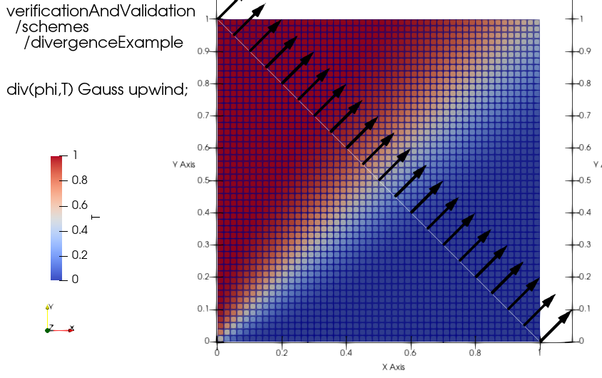
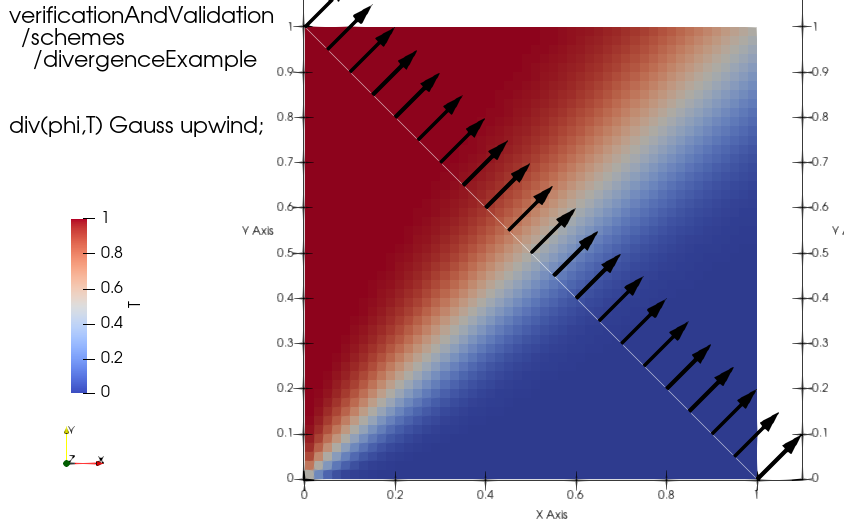
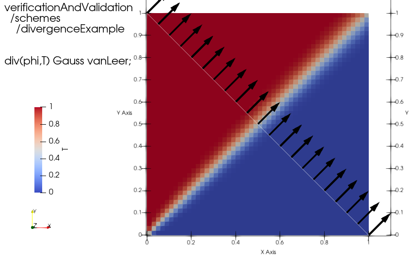
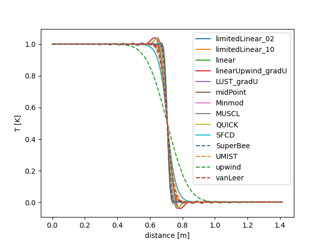

## schemes/divergenceExample

### 公式情報

リポジトリ：

[https://develop.openfoam.com/Development/openfoam/-/tree/master/tutorials/verificationAndValidation/schemes/divergenceExample](https://develop.openfoam.com/Development/openfoam/-/tree/master/tutorials/verificationAndValidation/schemes/divergenceExample)

公式サイトによる説明ページ：

[https://www.openfoam.com/documentation/guides/latest/doc/guide-schemes-divergence-example.html](https://www.openfoam.com/documentation/guides/latest/doc/guide-schemes-divergence-example.html)

### 概要

scalarTransportFoamを使用する。

温度場の初期値は1e-8と小さい値。左面は値を1，下面は値を0で固定する。

拡散係数`DT`は0と設定してあるため，拡散の影響はない。

速度場の初期値は (1 1 0)であり，斜め上に一様に流れが存在する状態とする。左面および下面も同様に (1 1 0) とする。

`system/schemesToTest`ファイルに1行ごとに記載した設定を，`system/fvSchemes.template`ファイルの`divSchemes`設定の`div(phi, T)`設定に与える。

```c++: system/schemesToTest
limitedLinear 0.2
limitedLinear 1.0
linear
linearUpwind grad(U)
LUST grad(U)
midPoint
Minmod
MUSCL
QUICK
SFCD
SuperBee
UMIST
upwind
vanLeer
```


### Allrun

```
while read oneLineText
do
   # take some action
   echo $oneLineText
   
done < nameOfFile
```

readコマンドの`-r`オプションは，バックスラッシュの付いた文字をそのまま扱うためのものである。バックスラッシュがエスケープ文字として扱われるのを防ぐ。

`$@` コマンドライン引数全体を表す特殊な変数である。

UNIXシェルスクリプトマスターピース132，大角裕介，SB Creative(2015), p.252.

| 記法               | 意味 |
| ------------------ | :--- |
| `$@` | `$1`  `$2`  `$3`  ･･･ |
| `"$@"` | `"$1"`  `"$2"`  `"$3"`  ･･･ |


```bash: Allrun
#!/bin/bash
cd "${0%/*}" || exit                                # Run from this directory
. ${WM_PROJECT_DIR:?}/bin/tools/RunFunctions        # Tutorial run functions
#------------------------------------------------------------------------------

# Save the line plot
unset savePlots

if notTest "$@"
then
    savePlots=true
fi

restore0Dir

runApplication blockMesh

while read -r scheme
do
    echo "Updating fvSchemes to use $scheme"
    sed "s/DIVSCHEME/$scheme/g" system/fvSchemes.template > system/fvSchemes

    # Create a sanitised name for the scheme - remove 'special' characters
    schemeTag=$(sed -e 's# #_#g#' -e 's#[.()]##g' <<< "$scheme")

    runApplication -s "${schemeTag}" scalarTransportFoam

    if [ "$savePlots" = true ]
    then
        # Save the line plot
        mv -f postProcessing/sample1/100/line1_T.xy line1_T_"${schemeTag}".xy
    fi

done < system/schemesToTest

#------------------------------------------------------------------------------
```

#### RunFunctionsで定義されている関数たち

`notTest`は，RunFunctions内で定義されている関数である。コマンドライン引数中の`-test`オプション有無を確認する。

```shell
#
# Check absence of '-test' in the argument list.
#
notTest()
{
    for i; do [ "$i" = "-test" ] && return 1; done
    return 0
}
```

`restore0Dir`は，`0.orig/`ディレクトリをコピーして`0`ディレクトリを作成する。

```shell
# If 0.orig/ exists, copy (overwrite) into 0/ [ie, serial case]
# * -processor : copy into processor directories instead
# * -all : copy into serial and processor directories
restore0Dir()
{
    if [ ! -d 0.orig ]
    then
        echo "No 0.orig/ to restore..." 1>&2
        return 0
    fi

    case "$1" in
    (-all | -proc | -processor*)
        if [ "$1" = "-all" ]
        then
            echo "Restore 0/ from 0.orig/  [serial/processor dirs]" 1>&2
            \rm -rf 0
            \cp -r 0.orig 0 2>/dev/null
        else
            echo "Restore 0/ from 0.orig/  [processor dirs]" 1>&2
        fi

        \ls -d processor* | xargs -I {} \rm -rf ./{}/0
        \ls -d processor* | xargs -I {} \cp -r 0.orig ./{}/0 > /dev/null 2>&1
        ;;

    (*)
        echo "Restore 0/ from 0.orig/" 1>&2
        \rm -rf 0
        \cp -r 0.orig 0 2>/dev/null
        ;;
    esac
    return 0
}
```

## 結果例










## RunFunctions全体

https://develop.openfoam.com/Development/openfoam/-/blob/master/bin/tools/RunFunctions

```shell
#---------------------------------*- sh -*-------------------------------------
# =========                 |
# \\      /  F ield         | OpenFOAM: The Open Source CFD Toolbox
#  \\    /   O peration     |
#   \\  /    A nd           | www.openfoam.com
#    \\/     M anipulation  |
#------------------------------------------------------------------------------
#     Copyright (C) 2011-2016 OpenFOAM Foundation
#     Copyright (C) 2015-2024 OpenCFD Ltd.
#------------------------------------------------------------------------------
# License
#     This file is part of OpenFOAM, distributed under GPL-3.0-or-later.
#
# Script
#     RunFunctions
#
# Description
#     Miscellaneous functions for running tutorial cases
#
#------------------------------------------------------------------------------

# The normal locations
[ -n "$FOAM_TUTORIALS" ] || export FOAM_TUTORIALS="$WM_PROJECT_DIR"/tutorials

# Basic sanity checks
[ -d "$FOAM_TUTORIALS" ] || echo "No OpenFOAM tutorials? : $FOAM_TUTORIALS" 1>&2

# Darwin workaround - SIP clearing DYLD_LIBRARY_PATH variable
if [ -n "$FOAM_LD_LIBRARY_PATH" ] && [ -z "$DYLD_LIBRARY_PATH" ]
then
    export DYLD_LIBRARY_PATH="$FOAM_LD_LIBRARY_PATH"
fi


#------------------------------------------------------------------------------

#
# Check presence of '-parallel' in the argument list.
#
isParallel()
{
    for i; do [ "$i" = "-parallel" ] && return 0; done
    return 1
}


#
# Check presence of '-test' in the argument list.
#
isTest()
{
    for i; do [ "$i" = "-test" ] && return 0; done
    return 1
}

#
# Check absence of '-test' in the argument list.
#
notTest()
{
    for i; do [ "$i" = "-test" ] && return 1; done
    return 0
}

#
# Test for make/wmake, compiler suite or emit warning
#
canCompile()
{
    # system
    if ! command -v make >/dev/null
    then
        echo "No system 'make' command found ... cannot compile" 1>&2
        return 1
    fi

    # OpenFOAM-specific
    if ! command -v wmake >/dev/null
    then
        echo "No openfoam 'wmake' command found ... cannot compile" 1>&2
        return 1
    fi

    local cxx_compiler
    cxx_compiler="$(wmake -show-cxx 2>/dev/null)"

    if [ -z "$cxx_compiler" ]
    then
        echo "No wmake rule for C++ compiler ... cannot compile" 1>&2
        return 1
    elif ! command -v "$cxx_compiler"  >/dev/null
    then
        echo "No path to C++ compiler ($cxx_compiler) ... cannot compile" 1>&2
        return 1
    fi

    return 0
}


#
# Check if '$1' corresponds to an OpenFOAM value for 'true' (see Switch.H)
# - does not handle integers very much, although Switch does
#
# Handles -dict as first argument to relay the balance to foamDictionary
# Eg,
#     isTrue -dict controls -entry coupling
# ->
#     value=$(foamDictionary controls -entry coupling -value)
#     if value ...
#
isTrue()
{
    local value="$1"

    if [ "$value" = "-dict" ]
    then
        shift
        value="$(foamDictionary -value $@ 2>/dev/null)" || return 2
    fi

    case "$value" in
        (t | y | true | yes | on)  return 0 ;;
        (f | n | false | no | off) return 1 ;;
    esac
    return 2
}


#
# Extract 'nFaces' for given patchName from constant/polyMesh/boundary
# or constant/{region}/polyMesh/boundary
#
# On failure:
#    return '1'
#    exit status 1
#
getNumberOfPatchFaces()
{
    local patch="${1:-}"
    local file="${2:-}"

    file="constant/$file${file:+/}polyMesh/boundary"

    [ -n "$patch" ] || {
        echo "No patch name given" 1>&2
        return 1
    }

    [ -f "$file" ] || {
        echo "No such file: $file" 1>&2
        return 2
    }

    local nFaces
    nFaces=$(sed -ne \
        '/^ *'"$patch"' *$/,/}/{s/^ *nFaces  *\([0-9][0-9]*\) *;.*$/\1/p}' \
        "$file")

    if [ -n "$nFaces" ]
    then
        echo "$nFaces"
    else
        echo "No patch entry found for '$patch' in $file" 1>&2
        echo 0      # Report as 0
        return 2
    fi
}


#
# Extract 'numberOfSubdomains' from system/decomposeParDict
# (or alternative location).
#
# On failure:
#    return '1'
#    exit status 1
#
getNumberOfProcessors()
{
    local dict="${1:-system/decomposeParDict}"

    case "$dict" in
    (system/*)  # Already qualified
        ;;
    (*)
        # If it does not exist, assume it refers to location in system/
        [ -f "$dict" ] || dict="system/$dict"
        ;;
    esac


    # Re-use positional parameters for automatic whitespace elimination
    set -- $(foamDictionary -entry numberOfSubdomains -value "$dict" 2>/dev/null)

    if [ "$#" -eq 1 ]
    then
        echo "$1"
    else
        echo "Error getting 'numberOfSubdomains' from '$dict'" 1>&2
        echo 1      # Fallback is 1 proc (serial)
        return 1
    fi
}


#
# Extract 'application' from system/controlDict
#
# On failure:
#    return 'false' which is also a command (ie, shell builtin or /bin/false)
#    exit status 1
#
getApplication()
{
    # Re-use positional parameters for automatic whitespace elimination
    set -- $(foamDictionary -entry application -value system/controlDict 2>/dev/null)

    if [ "$#" -eq 1 ]
    then
        echo "$1"
    else
        echo "Error getting 'application' from system/controlDict" 1>&2
        echo false  # Fallback
        return 1
    fi
}


#
# Run given application in serial with logfile output.
# The preexistence of the log file prevents rerunning.
#
runApplication()
{
    local appName appRun optValue logFile logMode

    # Any additional parsed arguments (eg, decomposeParDict)
    local appArgs

    # Parse options until executable is encountered
    while [ "$#" -gt 0 ] && [ -z "$appRun" ]
    do
        case "$1" in
        ('') ;;  # Ignore junk

        (-a | -append)
            logMode=append
            ;;
        (-o | -overwrite)
            logMode=overwrite
            ;;
        (-s | -suffix)
            logFile=".$2"
            shift
            ;;

        (-decompose-dict=*)
            optValue="${1#*=}"
            case "$optValue" in
            ('' | none | false) ;;  ## Ignore
            (*) appArgs="$appArgs -decomposeParDict $optValue" ;;
            esac
            ;;

        (-decomposeParDict)
            optValue="$2"
            shift
            case "$optValue" in
            ('' | none | false) ;; ## Ignore
            (*) appArgs="$appArgs -decomposeParDict $optValue" ;;
            esac
            ;;

        (*)
            appRun="$1"
            ;;
        esac
        shift
    done

    appName="${appRun##*/}"
    logFile="log.$appName$logFile"

    if [ -f "$logFile" ] && [ -z "$logMode" ]
    then
        echo "$appName already run on $PWD:" \
             "remove log file '$logFile' to re-run"
    else
        echo "Running $appRun on $PWD"
        if [ "$logMode" = append ]
        then
            $appRun $appArgs "$@" >> $logFile 2>&1
        else
            $appRun $appArgs "$@" > $logFile 2>&1
        fi
    fi
}


#
# Run given application in parallel with logfile output.
# The preexistence of the log file prevents rerunning.
#
runParallel()
{
    local appName appRun optValue logFile logMode
    local mpiopts nProcs

    # Any additional parsed arguments (eg, decomposeParDict)
    local appArgs="-parallel"

    local mpirun="mpirun"
    case "$FOAM_MPI" in
    (msmpi*)
        mpirun="mpiexec"
        ;;
    (*openmpi*)
        mpiopts="--oversubscribe"
        ;;
    esac

    # Parse options until executable is encountered
    while [ "$#" -gt 0 ] && [ -z "$appRun" ]
    do
        case "$1" in
        ('') ;;  # Ignore junk

        (-a | -append)
            logMode=append
            ;;
        (-o | -overwrite)
            logMode=overwrite
            ;;
        (-s | -suffix)
            logFile=".$2"
            shift
            ;;
        (-n | -np)
            nProcs="$2"
            shift
            ;;
        (-decompose-dict=*)
            optValue="${1#*=}"
            case "$optValue" in
            ('' | none | false) ;;  ## Ignore
            (*)
                appArgs="$appArgs -decomposeParDict $optValue"
                nProcs="$(getNumberOfProcessors "$optValue")"
                ;;
            esac
            ;;
        (-decomposeParDict)
            optValue="$2"
            shift
            case "$optValue" in
            ('' | none | false) ;;  ## Ignore
            (*)
                appArgs="$appArgs -decomposeParDict $optValue"
                nProcs="$(getNumberOfProcessors "$optValue")"
                ;;
            esac
            ;;
         (*)
            appRun="$1"
            ;;
        esac
        shift
    done

    [ -n "$nProcs" ] || nProcs=$(getNumberOfProcessors system/decomposeParDict)

    appName="${appRun##*/}"
    logFile="log.$appName$logFile"

    if [ -f "$logFile" ] && [ -z "$logMode" ]
    then
        echo "$appName already run on $PWD:" \
             "remove log file '$logFile' to re-run"
    else
        echo "Running $appRun ($nProcs processes) on $PWD "
        # Options '-n' and '-np' are synonymous, but msmpi only supports '-n'
        if [ "$logMode" = append ]
        then
        (
            "$mpirun" $mpiopts -n "${nProcs:?}" $appRun $appArgs "$@" </dev/null >> $logFile 2>&1
        )
        else
        (
            "$mpirun" $mpiopts -n "${nProcs:?}" $appRun $appArgs "$@" </dev/null > $logFile 2>&1
        )
        fi
    fi
}


compileApplication()
{
    echo "Compiling $1 application"
    wmake $1
}


#
# cloneCase srcDir dstDir
#
cloneCase()
{
    local src=$1
    local dst=$2
    shift 2

    if [ -e "$dst" ]
    then
        echo "Case already cloned: remove case directory $dst prior to cloning"
        return 1
    elif [ ! -d "$src" ]
    then
        echo "Error: no directory to clone:  $src"
        return 1
    fi

    echo "Cloning $dst case from $src"
    mkdir $dst
    # These must exist, so do not hide error messages
    for f in constant system
    do
        \cp -r $src/$f $dst
    done

    # Either (or both) may exist, so error messages may be spurious
    for f in 0 0.orig
    do
        \cp -r $src/$f $dst 2>/dev/null
    done
    return 0
}


#
# cloneParallelCase srcDir dstDir [...times]
#
# If any times are specified, they will be used for the cloning.
# Otherwise the entire processor* directories are cloned
cloneParallelCase()
{
    local src=$1
    local dst=$2
    shift 2

    if [ -e "$dst" ]
    then
        echo "Case already cloned: remove case directory $dst prior to cloning"
        return 1
    fi

    [ -d "$src" ] || {
        echo "Error: no directory to clone: $src"
        return 1
    }

    echo "Cloning $dst parallel case from $src"
    mkdir $dst
    # These must exist, so do not hide error messages
    for f in constant system
    do
        \cp -r $src/$f $dst
    done

    [ -d $src/processor0 ] || {
        echo "Does not appear to be a parallel case"
        return 1
    }

    if [ "$#" -eq 0 ]
    then
        # Copy all processor directories
        echo "    clone processor* directories"
        \cp -r $src/processor* $dst
    else
        # Only copy some time directories
        echo "    clone processor directories with $# times: $@"

        for proc in $(\cd $src && \ls -d processor*)
        do
            srcProc=$src/$proc
            dstProc=$dst/$proc

            mkdir $dstProc
            \cp -r $srcProc/constant $dstProc/

            for time
            do
                [ -d $srcProc/$time ] && \cp -r $srcProc/$time $dstProc/
            done

        done
    fi

    return 0
}


# If 0.orig/ exists, copy (overwrite) into 0/ [ie, serial case]
# * -processor : copy into processor directories instead
# * -all : copy into serial and processor directories
restore0Dir()
{
    if [ ! -d 0.orig ]
    then
        echo "No 0.orig/ to restore..." 1>&2
        return 0
    fi

    case "$1" in
    (-all | -proc | -processor*)
        if [ "$1" = "-all" ]
        then
            echo "Restore 0/ from 0.orig/  [serial/processor dirs]" 1>&2
            \rm -rf 0
            \cp -r 0.orig 0 2>/dev/null
        else
            echo "Restore 0/ from 0.orig/  [processor dirs]" 1>&2
        fi

        \ls -d processor* | xargs -I {} \rm -rf ./{}/0
        \ls -d processor* | xargs -I {} \cp -r 0.orig ./{}/0 > /dev/null 2>&1
        ;;

    (*)
        echo "Restore 0/ from 0.orig/" 1>&2
        \rm -rf 0
        \cp -r 0.orig 0 2>/dev/null
        ;;
    esac
    return 0
}

#------------------------------------------------------------------------------

```
